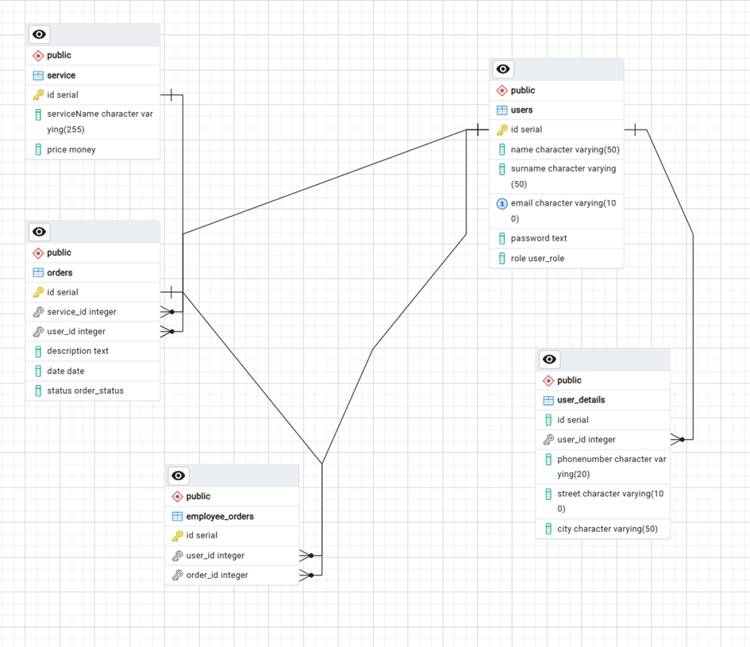
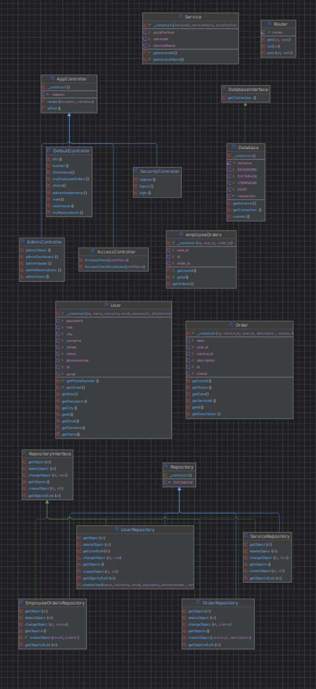
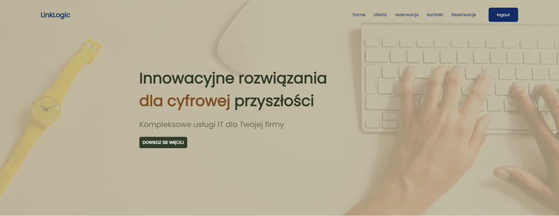
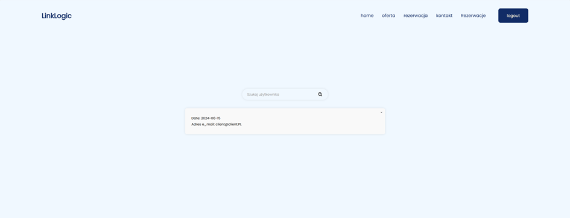
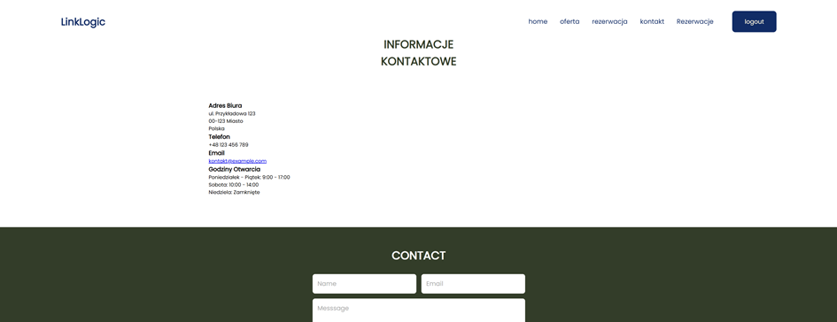
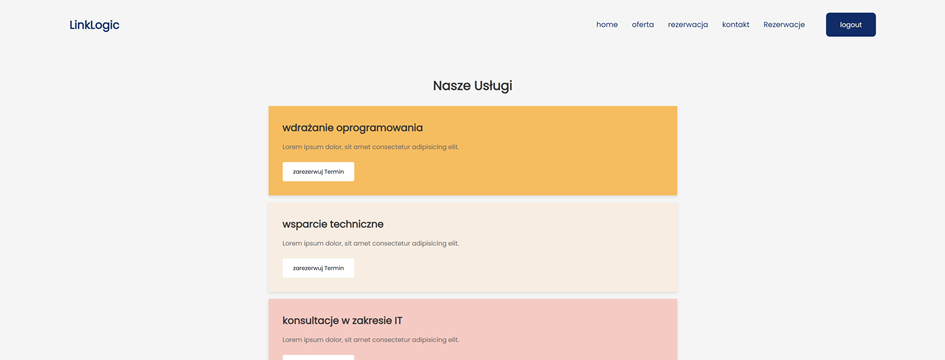

# APLIKACJA INTERNETOWA FIRMY E-COMMERCE

Cele Projektu: 
	Mój projekt to aplikacja internetowa przykładowej firmy e-commerce, zajmująca się szeroko pojętym IT. W systemie stworzyłem funkcjonalności potrzebne do zarządzania rezerwacjami dotyczącymi usług informatycznych i obsługiwania tych rezerwacji przez konkretnych pracowników firmy. 
	Aplikacja dzieli użytkowników na trzy role: client, employee oraz admin, każdy z nich ma inne możliwości w systemie. Client jest to klient strony, ma on możliwość składania rezerwacji, a także może podglądać je w systemie i sprawdzać ich stan oraz kluczowe informacje. Admin zarządza wszystkimi kontami w systemie, może modyfikować role wszystkich użytkowników, a także ich usuwać. Dodatkowo zarządza on rezerwacjami, ustawia ich status oraz może je przekazać do wykonania konkretnym pracownikom. Employee, czyli pracownik jest w stanie podglądać zamówienia które przekazał mu do wykonania admin. Po ich zakończeniu ustawia status zadania na wykonane, a rekord znika z jego listy.

## Table of Contents
1. [Features](#features)
2. [Technologies](#technologies)
3. [Database Design and Structure](#database-design-and-structure)
4. [ERD](#ERD)
5. [Screenshots](#screenshots)

## Features
1. Logowanie i rejestracja nowych klientów
	-logowanie dla wszytskich aktorów systemu: admin, client i employee
2. Dostepność do konkretnych modułów przez konkretnych aktorów
	-client
		-może składać rezerwacje
		-może podglądać swoje rezerwacje
	-admin
		-może zarządzać użytkownikami
			-usatwiać ich uprawnienia
			-usuwać 
		-może zarzadzać rezerwacjami
			-zmieniać status rezerwacji
			-przekazywać do wykonania pracownikom
			-usuwać 
	-emplyee
		-podglądać zlecone mu zadania
		-zmieniać ich status na wykonane
3. Informacje o koncie
	-każdy użytkownik może podejrzeć swoje dane osobowe w systemie
4. Wylogowywanie
	-każdy użytkownik może sie wylogować z konta
5. Zarządzanie sesją i dostępem
	-każde logowanie odpala sesje
	-przejście na strone na którą nie mamy dostepu skutkuje przeniesieniem na strone główną

## Technologies

- HTML
- CSS
- JavaScript
- PHP
- NGINX
- PostgresSQL
- Docker

## Database Design and Structure

	-users: user data
		-name
		-surname
		-email
		-password
		-role
	-user_details: user data
		-phonenumber
		-street
		-city
	-orders: zamowienia
		-opis
		-data
		-status
	-service: usługi
		-ServiceName
		-price
	-employee_orders
		-user_id
		-order_d

## UML

## Screenshots
zdjecia poszczególnych części projektu

		